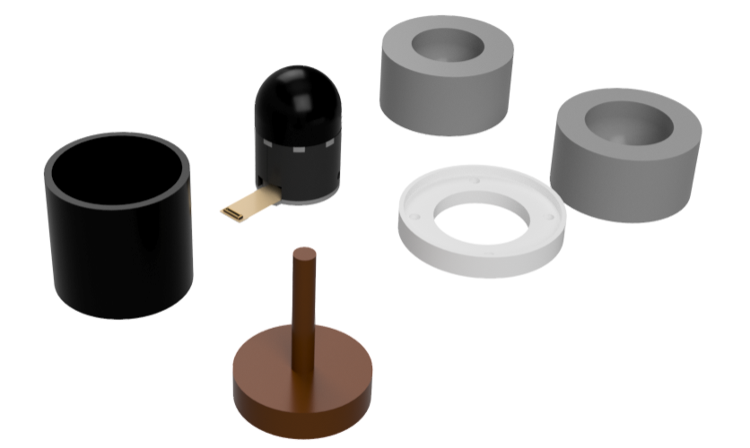
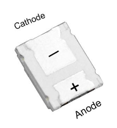
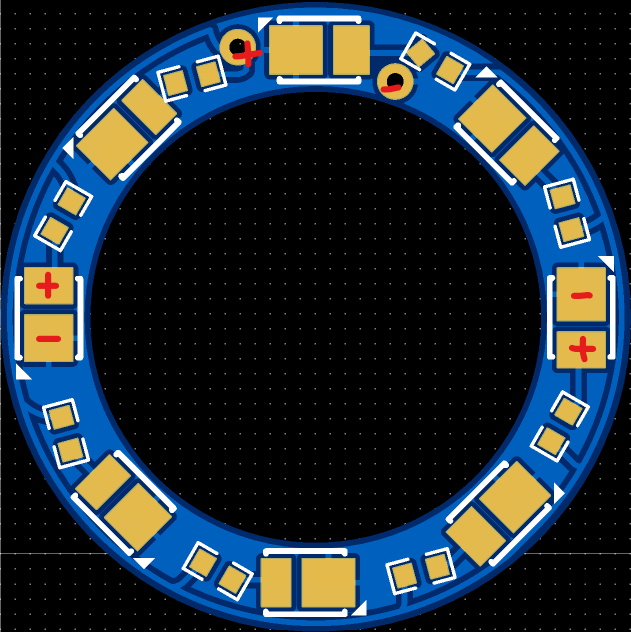
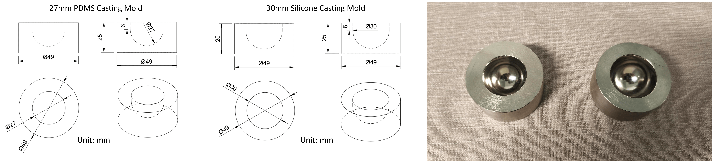

# PP-Tac: Paper Picking Using Tactile Feedback in Dexterous Robotic Hands

[Pei Lin](http://peilin-666.github.io/)1,2,
[YuZhe Huang]1,3,
[Wanlin Li](https://mrliwanlin.github.io/)1,
[Jianpeng Ma]1,
[Chenxi Xiao](https://scholar.google.com/citations?hl=zh-CN&user=Qhiy3doAAAAJ)2,
[Ziyuan Jiao](https://scholar.google.com/citations?user=YfWhJZoAAAAJ&hl=zh-CN&oi=ao)1

1Beijing Institute for General Artificial Intelligence,
2ShanghaiTech University,
3Beihang University

# R-Tac Sensor Guide
[[Project page]](https://peilin-666.github.io/projects/PP-Tac/)
[[Paper]](https://arxiv.org/abs/2504.16649)
[[Video Tutorial]](https://peilin-666.github.io/projects/PP-Tac/)

## CAD Models</a>
All CAD models can be downloaded and edited from [[onshape]](https://cad.onshape.com/documents/9472112f26da7f3a688b4739/w/3c5ca2de4889759493b1cc6c/e/c49e7e8ea4181ab75b1e7674)
(right click and copy link address to enter). 
3D printed files (print with supportings) can be found in [3Dprinting](Model/3Dprinting).

## Camera</a>
We use OV9281 Monochrome camera module which can be bought from [Taobao](https://item.taobao.com/item.htm?_u=u1tj68hd552c&id=740654464379&pisk=gZna_DMwEhKwG0VTSDZVTIknu9qTXoRWimNbnxD0C5VMkRtc0xkuhddvB2ymGXpvBlM0gjlQ9iwXWIIqTfMo5PGj5S20tXD1fStTujkSwjsXXVwc0XMYojiqHiymnjpTGdLIBAEYmQO7g3MtBJlqX5nai6Xnp-BGmeaG7Hk6dQOWVn8GKoRwNj_MG-83U8q0IP2gxpybn-2mir23tWeYn12cjpJU9-ygnS4iK62zhOqcjSDh-8wlmZV0s6x39-q0ijqDLkVLnfPgmuIUUPvxSnj1hIZY77DgTgk-DR01WANF3tmE8PPlVWScmDyZp7uIZg8bZ4F_P5hHAGrqK-lUPVRPbjkmeq4E01vsZxctYlEyldUr-2g772RG0Wis8DrsjIQ-dvPgzkgBJCabbfu8wPYp9jkU1jma-1RQG4MIjylkOMlYuqm_xcAH4g8dMJVRBm3NiZzgpJPWLpWVhqJbp0L0MZQYW9eUNdpOkZUgpJPWLp7AkPdLL799B&spm=a1z09.2.0.0.7c6f2e8dTlGL9i) or [Amazon](https://www.amazon.co.uk/Global-Shutter-Camera-Detection-Modules-100-degrees/dp/B0D5SNTHSD/ref=sr_1_11?crid=2R23XLE5BSYKH&dib=eyJ2IjoiMSJ9.gA3Y_wyUXfWGtyqmUP0W8uhaOtlGlJwBw8w8nT7Cm9Tn-N7f2UTGKzxSLvTmrH0WFhyYXvINhPoG-X2aafG56-EZ_NEBnZzTOUSfDsTdBUi7AcLWAB7GRZKhZwq8c-t_ErVAtIW3Mwx3082KfpEOhQ.sxC83F-wssS75YhGELiLQ7isbcCWWrhWGU-3zvZtcMA&dib_tag=se&keywords=Ov9281&qid=1748600054&sprefix=ov9281%2Caps%2C296&sr=8-11)

## PCBs</a>
The PCB files can be downloaded from [PCB](PCB/) and is powered by 5V. 
If you opt for white LED chips, it is recommended to select the 2835 package type and pay attention to the anode and cathode of the LED chips. 

  
  

## Diffuser Boards</a>
Diffuser patterns (.dxf) can be downloaded from [Diffuser](Model/Diffuser). It is recommended to laser-cut the [double-sided frosted one](https://detail.tmall.com/item.htm?_u=u1tj68hd2040&id=550079594688&pisk=gz4QsiAykpvCu90JNDfw5a6vTQ07V17VyQG8i7Lew23KVUFUhb8r4McWPANAtvSlx8Z_eRmEpYorPbwqIW8PtW55P7Fxp4rELbeaFRxULzkzQaN0hD8UwzR3j-Pv8ySnzUgnr4BV3Z7qTW0oyX7s6w9n6jGRzUnJv2093vOFDZ74t5OE9sPOuz79ZilB2Ue-vVLtaAhKwULd1chrZ4LK2eK9BADtypKK9CFtZjdp98hpW5hoiBKpvYK96XDte438e5CsaAH-9vQs_MMLO6J8xoTCqBPSCUL85fBnHW69zfaZOqkbAy_Pz_cIAxFKCtW0K7nTZ0akZUia9o2oMJpdFY4_6yEYHO-EpoG7guwAaHcZVy0seyQDGAUQNPi3bZpsslFU2y2BNUh38roSnc1Jr0uTumEYdQf062h8Em4PneDLwS400q_BnXZTGVsrYEkfnW-W1mYS1x5113xoucPAK1xN7qnKsfJV119BqDhi1x5113xovfcNg116d3f..&spm=a1z09.2.0.0.137e2e8dJizF4s). You can also try 3D printing with white resin.  

## Metallic Mold</a>
The design files can be downloaded from [Mold](Model/MetalMold). Two molds are needed for PDMS casting (27mm diameter) and Silicone casting (30mm diameter). The mold is fabricated using stainless steel with polished and buffing cavity. 

## BOM</a>

| Component | Description | Remark |
|------|------|------|
| PDMS | Transparent base | [SYLGARD™ 184](https://www.dow.com/en-us/pdp.sylgard-184-silicone-elastomer-kit.01064291z.html#overview) |
| Silicone | Translucent layer | [Ecoflex™ 00-10](https://www.smooth-on.com/products/ecoflex-00-10/) |
| Black pigment | Coating colorant | [Silc Pig™](https://www.smooth-on.com/products/silc-pig/) |
| Coating | Coating layer | [Psycho Paint™](https://www.smooth-on.com/products/psycho-paint/) |
| Thinner | Coating layer thinner | [NOVOCS™ Matte](https://www.smooth-on.com/products/novocs/) |
| Release agent | Silicone release agent | [Ease Release™ 200](https://www.smooth-on.com/products/ease-release-200/) |
| Bolts | M2 * 4 & M1.6 * 5 & M3 *4 | bolts |
| Hot melt nuts | M2 * 2 * 3 | nuts |
| Soldering iron | Compatiable with above nuts | [Soldering Iron](https://item.taobao.com/item.htm?_u=i2jo70qs4f40&id=676644094694&spm=a1z09.2.0.0.32402e8dfa9bP4)|
| Scale | For silicone mixing | Electronic Scale |
| Tape | Double-sided tape | Tape |
| Stick | Stirring silicone | Small Wood Stick |
| Cup | Container for silicone | Disposable Cups |
| Sticker | Dust removal of silicone surface | [Sticker](https://item.taobao.com/item.htm?_u=i2jo70qsf114&id=561103645534&spm=a1z09.2.0.0.32402e8dfa9bP4)|
| Vacuum pump | Air degassing for silicone | [Vacuum Pump](https://detail.tmall.com/item.htm?_u=i2jo70qs227b&id=593806957297&spm=a1z09.2.0.0.32402e8dfa9bP4&skuId=4811795832968)|
| Other tools | Small scissor, tweezer, knife | Tools |

## Video Guide</a>
[[YouTube]](https://www.youtube.com/watch?v=-npk0cRKWGI)
[[Bilibili]]()

